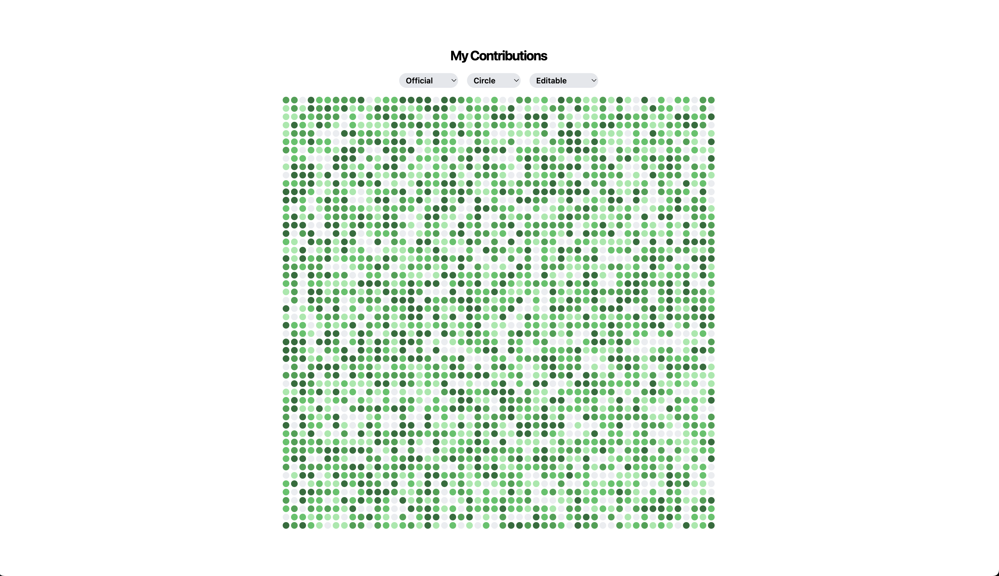

# GH Contribution Shapes

GH Contribution Shapes.



## Demo


## Get Started

1. Clone the repository:

```bash
git clone

cd gh-contribution-shapes
```

2. Install the dependencies:

```bash
pnpm install
```

3. Start the development server:

```bash
pnpm dev
```
